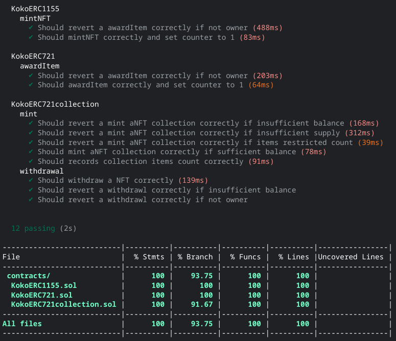

# NFT COLLECTION

- A `hardhat` unit tested `ERC-721` and `ERC-1155` contracts that has been 100% covared with `mint/burn` features for contract creator without using libraries.
- The contracts conform to the `ERC-721` and `ERC-1155` as includes all the functions and events described in the standard, while keeping their names.

- `ERC-721` Deployed and Verified on [goerli](https://goerli.etherscan.io/address/0xB2C25d990f4FC8521Ba4Ca8dcd3E4800BDC61b5A#code)
- `ERC-1155` Deployed and Verified on [goerli](https://goerli.etherscan.io/address/0x1176b276Fd237A5fdF86a165EEA4621E776Cab52#code)

- `ERC-721` published on [opensea](https://testnets.opensea.io/assets/goerli/0xb2c25d990f4fc8521ba4ca8dcd3e4800bdc61b5a/1)
- `img` published on [ipfs](https://ipfs.io/ipfs/QmZPHoUR1hy5RgrjqMp7pZXx3wFM56kB5qaMGYingfEeNS/koko.png)
- `meta` published on [ipfs](https://ipfs.io/ipfs/QmTganNHtwXxv58eedFo7F9BtzPWAXsRDhLTGM4yz8pb3t/KokoNFT.json)

- with [owner](https://sepolia.etherscan.io/address/0x741e0608906B74B8754a99413A7374FdE7B9779a)

## hardhat tasks:

- `npm install hardhat`
- `npx hardhat coverage`
- `npx hardhat run --network goerli scripts/deployERC721.ts`
- `npx hardhat run --network goerli scripts/deployERC1155.ts`
- `npx hardhat mintNFT --network goerli --recipient 0x741e0608906B74B8754a99413A7374FdE7B9779a --tokenuri ipfs://QmTganNHtwXxv58eedFo7F9BtzPWAXsRDhLTGM4yz8pb3t/KokoNFT.json`
- `npx hardhat awardItem --network goerli --recipient 0x741e0608906B74B8754a99413A7374FdE7B9779a --uri ipfs://QmTganNHtwXxv58eedFo7F9BtzPWAXsRDhLTGM4yz8pb3t/KokoNFT.json`

## coverage

 

</a>

 
